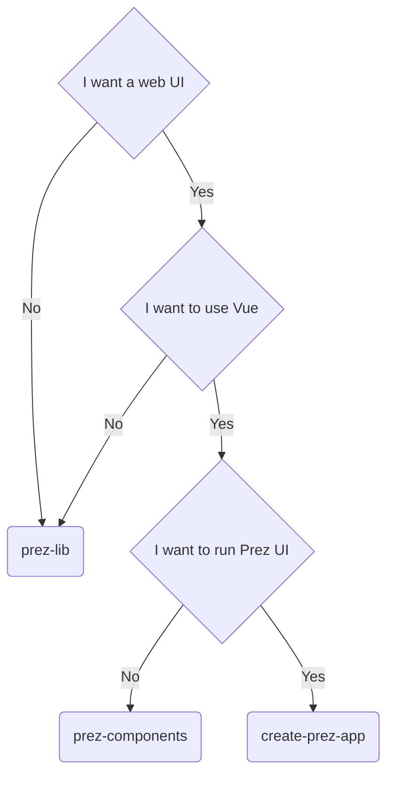

# Prez UI

The new structure is as follows:
- docs: will contain install instructions, how to use, etc.
- examples: will contain a few different use cases of using the various libraries
- packages
    - `prez-lib`: the JS library containing RDF processing logic
    - `prez-components`: the Vue component library
    - `prez-ui`: the base Nuxt application
    - `create-prez-app`: a NPX starter template for initialising a Prez UI theme

## How do I decide what to use?

