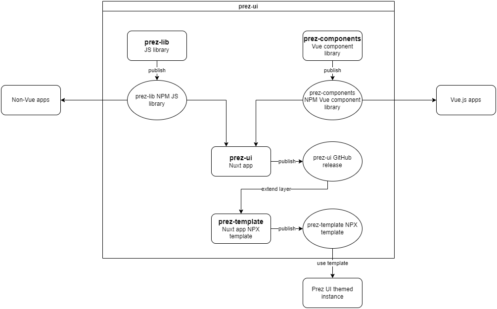

# Prez UI
Now separated into multiple projects for reusability.

- `prez-lib` - for JS logic for API request & [N3.js](https://github.com/rdfjs/N3.js) store patterns
- `prez-components` - Vue.js component library to be used by `prez-ui` & other Vue.js apps. Later might export as a web component library.
- `prez-ui` - [Nuxt](https://nuxt.com/) app using `prez-components` re-exporting components as a layer for running Prez UI instances with `prez-template`. Contains the pages & routing for Prez UI.
- `prez-template` - a Nuxt template for customisable Prez UI themes. Inherits the components & page routing which can be overridden by using Nuxt layers. Intended to published and used as a NPX create template

NOTE: This repo now uses [`pnpm`](https://pnpm.io) - a more performant package manager to replace `npm` - and uses a root workspace to reuse dependencies and local packages.

# Running in local dev
- run "pnpm i" in the root project folder
- run "pnpm storybook" in the prez-components folder to view the storybook for prez-components

