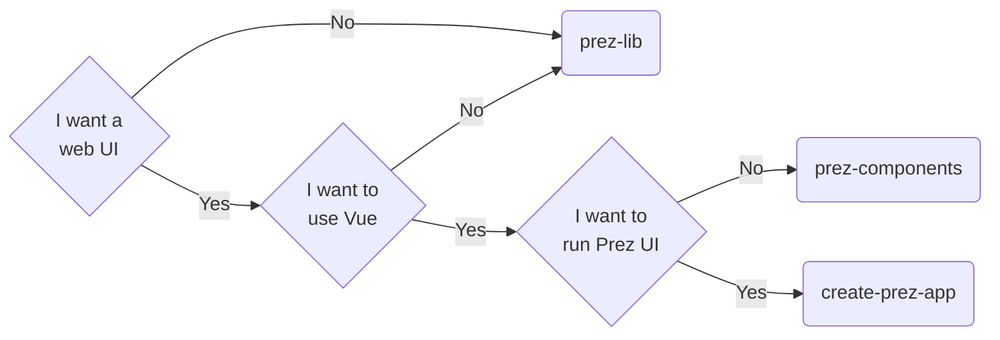

# Prez UI
Prez UI is the front end of [Prez](https://github.com/RDFLib/prez) - a linked data API - and is a suite of packages to interact with and render RDF in JavaScript.


## Contents
- [Running Prez UI](#running-prez-ui)
- [Packages](#packages)
- [License](#license)

## Running Prez UI
There are several ways to use Prez UI's suite of features. The most common way to run Prez UI is by creating a 'themed' instance using `create-prez-app`. You can do so by running:

```bash
npx create-prez-app@latest <project_name>
```
_(Note: for pnpm, run `pnpm dlx` instead of `npx`)_

See the included README in the starter template from the above command, or the [theming documentation](./docs/theming.md) for more information on how to get started.

> [!IMPORTANT]  
> If you're upgrading your Prez UI theme from < v4.2.0, you will need to [follow the upgrade guide](./docs/upgrade.md) to upgrade to Tailwind v4, which is a breaking change.

> [!NOTE]  
> For v4.0.0 only, a few small changes need to be made to the starter template to be able to run your theme
> - the `prez-ui` dependency version should be set to `^4.0.0` ***before*** installing
> - if you're enabling the SPARQL page, copy the `sparql.vue` page from the prez-ui source code into your template and install [`@triply/yasgui`](https://www.npmjs.com/package/@triply/yasgui)

For other use cases, see the below packages that are available.

## Packages
Prez UI is comprised of 4 NPM packages:
- [`prez-lib`](./packages/prez-lib/): the JavaScript library containing RDF processing logic
- [`prez-components`](./packages/prez-components/): the [Vue.js](https://vuejs.org/) component library
- [`prez-ui`](./packages/prez-ui/): the base layer [Nuxt](https://nuxt.com/) application
- [`create-prez-app`](./packages/create-prez-app/): the NPX starter template for initialising a Prez UI theme

### How do I decide what to use?



## License
This version of Prez UI and the contents of this repository are also available under the [BSD-3-Clause License](https://opensource.org/license/BSD-3-Clause). See this repository's [LICENSE](./LICENSE) file for details.
