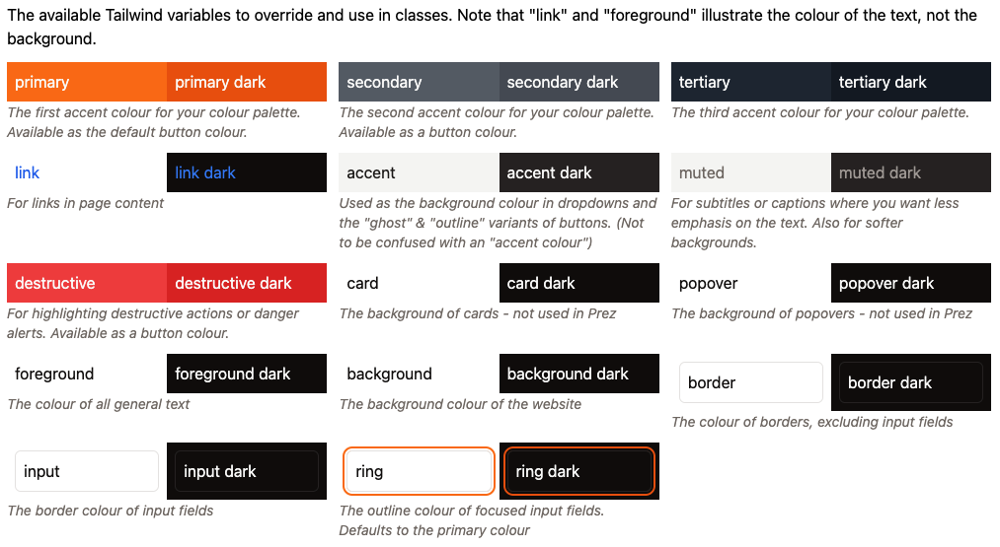

# Prez UI Theming

## Quick Start
To get started running your own Prez UI instance, simply run the following to get the starter template, replacing `<project_name>` with your project name (requires NPM installed, (we recommend [pnpm](https://pnpm.io))):

```bash
npx create-prez-app@latest <project_name>
```
*(Note: for pnpm, run `pnpm dlx` instead of `npx`)*

or

```bash
npm create prez-app@latest <project_name>
```

This will download a starter template [Nuxt](https://nuxt.com) project extending Prez UI's [base layer](https://github.com/rdflib/prez-ui/tree/main/packages/prez-ui).

In the project root directory, install with your NPM package manager of choice:

```bash
npm install
```

Then preview your theme by running:

```bash
npm run dev
```

You may need to open the dev server (http://localhost:3000) in a second window in a private tab or different browser on first load to resolve the layout rendering error.

## Tailwind & CSS
Prez UI uses [Tailwind](https://tailwindcss.com) for most of its styling, which you can use in this starter template to easily style using classes.

To override Prez UI's colour scheme (e.g. `primary`, `secondary`, etc.), or add your own variables to use in Tailwind, simply add a CSS variable of the same name in `app/assets/css/tailwind.css` under `:root` with its colour values in HSL **without** commas between values. Dark mode variants of those variables goes in the `.dark` block. New variables are registered in the `@theme inline` block in the same file. For colours, prefix the variable with `--color-*`, e.g.:

```CSS
/* app/assets/css/tailwind.css */

...

:root {
    /* define your Tailwind CSS variables (in HSL without commas) here */

    /* overridden variables */
    --primary: hsl(24.6 95% 53.1%); 
    --primary-foreground: hsl(60 9.1% 97.8%);

    /* new variable */
    --my-new-variable: hsl(70 10.8% 91.3%);
}

.dark {
    /* dark mode variants of CSS variables go here */
}

@theme inline {
    ...
    /* any new tailwind variables you declare go here. Colours are prefixed with --color-* */
    --color-my-new-variable: var(--my-new-variable);
}
```

You can also style your Prez UI theme using normal CSS by adding your styles to `app/assets/css/theme.css`.

### Tailwind Variables
Prez UI's Tailwind variables inherit from [shadcn-vue's variables](https://www.shadcn-vue.com/docs/theming.html#list-of-variables) (link content out of date). See Prez UI's default Tailwind variables [here](https://github.com/RDFLib/prez-ui/blob/main/packages/prez-components/src/assets/index.css).



## Extending the base layer
This starter template uses [layers](https://nuxt.com/docs/getting-started/layers) to extend upon the base Prez UI layer application, so you only need to customise what you need.

The layers system automatically replaces files of the same name with the same directory structure as previous layers. The files that can be overridden are:

- `app/components/*` - Extend the default components
- `app/composables/*` - Extend the default composables
- `app/layouts/*` - Extend the default layouts
- `app/pages/*` - Extend the default pages
- `app/plugins/*` - Extend the default plugins
- `app/utils/*` - Extend the default utils
- `app/app.config.ts` - Extend the default app config
- `server/*` - Extend the default server endpoints & middleware
- `nuxt.config.ts` - Extend the default nuxt config

Refer to Prez UI's base layer [source code](https://github.com/rdflib/prez-ui/tree/main/packages/prez-ui) to help you override files.

> [!WARNING]
> Override files at your own risk, as copying code means that future updates to overridden components must be done manually.

The most common case of theming Prez UI is adding a header, a footer, and modifying the nav for every page. This can easily be done by copying & overriding `LayoutHeader.vue`, `LayoutNav.vue` & `LayoutFooter.vue` in the `components/` directory. If further layout modifications are needed, you can also override the default layout in `layouts/default.vue`.

## shadcn-vue Components
Prez UI uses the [prez-components](https://github.com/rdflib/prez-ui/tree/main/packages/prez-components) component library, which is based on the [shadcn-vue](https://www.shadcn-vue.com) component library. Shad comes preinstalled in this starter template (`badge`, `button`, `input` & `pagination` are included as the base layer requires them), but if you need to add more shadcn components in your theme, run a command like the following to add the component:

```bash
npx shadcn-vue@latest add <component>
```
*(Note: for pnpm, run `pnpm dlx` instead of `npx`)*

These components are stored in `components/ui`, which should be kept separate to your theme's components.

## Other helpful tips
Assets such as images should go in the `public/` directory. You can also replace the favicon in this directory by providing your own with the same name and file extension. If the favicon isn't the same extension, you can add it in the `app` config below as a link element.

`nuxt.config.ts` contains some useful config for customising your Prez UI theme further. Here you can customise the document title, add external CSS (such as fonts), the base URL, and more. See [Nuxt Configuration](https://nuxt.com/docs/api/nuxt-config) for more details.

```typescript
// nuxt.config.ts example
export default defineNuxtConfig({
    ...
    app: {
        head: {
            title: "<document_title>",
            link: [
                { rel: "stylesheet", href: "<stylesheet_url>", type: "text/css" },
            ]
        }
    },
    ...
});
```

`app/app.config.ts` is where you can configure smaller content-related options such as the nav content, naming on certains items, and breadcrumbs. For overriding array variables such as `menu`, use the arrow function syntax `() => []` instead of re-setting the variable. Note you may get a false TypeScript error when doing this.

```typescript
// app/app.config.ts example
export default defineAppConfig({
    ...
    menu: () => [
        { "label": "Home", "url": "/", "active": true },
        { "label": "Catalogs", "url": "/catalogs", "active": true },
        { "label": "Search", "url": "/search", "active": true },
        { "label": "SPARQL", "url": "/sparql", "active": false },
        { "label": "Profiles", "url": "/profiles", "active": true },
        { "label": "About", "url": "/about", "active": true },
        { "label": "API Documentation", "url": "/docs", "active": true },
        { "label": "Custom link", "url": "/custom", "active": true },
    ],
    ...
});
```
